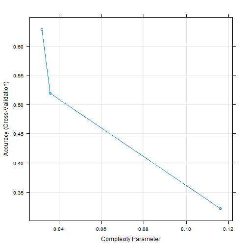
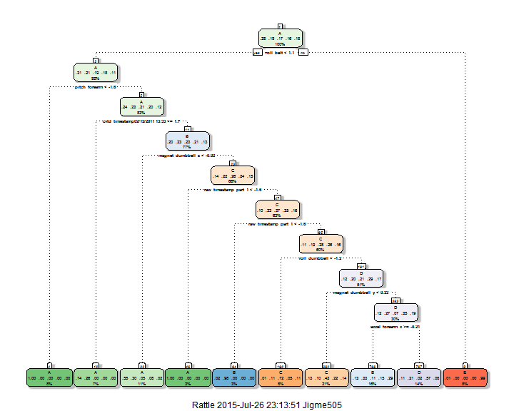

## Overview

The goal of this project is to use data from accelerometers on the belt, forearm, arm, and dumbell of 6 participants and predict the manner in which they did the exercise.They were asked to perform barbell lifts correctly and incorrectly in 5 different ways. 


## Loading the data 

First we will load both the training (df_train) and testing (df_test) data sets. However, we are not going to touch the testing data set until we have built our predictoin model and we want to test it.


Instead, we will be using the caret package to partition the training data set into testing and training subsets. I decided to partition it by p=0.8 (i.e. keep 80% of the observations as part of the training subset and the rest as the testing) using the createDataPartition() function.


```r
require(caret)
set.seed(200)
inTrain <- createDataPartition(df_train$classe, p=0.8, list=F)

training <- df_train[inTrain,]
testing <- df_train[-inTrain,]
```

There seems to be lot of predictors with lot of empty values (NA). These predictors would not be very useful in predicting the outcome and so I get rid of all the predictors that are of no use. I use the function apply() to get rid of the useless predictors from both the training and testing subset.


```r
training <- training[ , apply(training, 2, function(x) !any(is.na(x)))]
testing <- testing[ , apply(testing, 2, function(x) !any(is.na(x)))]

training <- training[,-1]
testing <- testing[,-1]
```


## Cross-Validation

I use trainControl() funtion to use the cross validation method. The idea is that, we have already split the main training data into training subset and testing subset and we will be building a model on the training set. So we want to use cross validation method on the training subset to further spit the training subset, build the model, test it and repeat that process as specified. 

## Model

Since the outcome variable is a group (factors), it doesn't make much sense to use regression models. So I decided to use the prediction with trees (rpart) model which is a method of classification. 

Here I am using the centering and scaling pre-process function as part of the model since using pca doesn't make sense in a classification model. 
 

```r
control =trainControl(method="cv", number=30, p=0.7)

mfit <- train(classe~., method="rpart", trControl=control, preProc=c("center","scale"), data = training)
mfit
```

```
## CART 
## 
## 15699 samples
##    58 predictor
##     5 classes: 'A', 'B', 'C', 'D', 'E' 
## 
## Pre-processing: centered, scaled 
## Resampling: Cross-Validated (30 fold) 
## Summary of sample sizes: 15176, 15177, 15177, 15175, 15175, 15176, ... 
## Resampling results across tuning parameters:
## 
##   cp          Accuracy   Kappa       Accuracy SD  Kappa SD  
##   0.03186471  0.6281910  0.53042092  0.03257529   0.04086821
##   0.03575137  0.5189439  0.37072058  0.10276494   0.16292229
##   0.11606587  0.3220439  0.05741559  0.03865832   0.05884373
## 
## Accuracy was used to select the optimal model using  the largest value.
## The final value used for the model was cp = 0.03186471.
```

So the cross-validation process allows us to pick the optimal model based on highest accuracy. The final complexity parameter used for the model was 0.032. The following graph shows the change in accuracy (cross-validation) with respect to change in complexity parameter. As 


```r
plot(mfit, uniform=T)
```



Here's the classification dendogram plot for the final model.



the probability values in the nodes determine the threshold probability of being in certain class. 

## Out of Sample Prediction

Now, we can try to use the final model to test the model on the testing subset. We use the predict() function and the confusion matrix to summarize the results. These results show the out of sample error rates.


```r
pred <- predict(mfit, newdata = testing)
Conf_matrix <- confusionMatrix(testing$classe, pred)
```

Here is our prediction results on the testing subset.

```
##           Reference
## Prediction   A   B   C   D   E
##          A 844  91 110  69   2
##          B 206 314 128 111   0
##          C  20  89 555  20   0
##          D  43  97 192 311   0
##          E  11 195 168  32 315
```

Here is the overall statistics

```
##       Accuracy          Kappa  AccuracyLower  AccuracyUpper   AccuracyNull 
##   5.962274e-01   4.895071e-01   5.806792e-01   6.116321e-01   2.939077e-01 
## AccuracyPValue  McnemarPValue 
##   0.000000e+00  1.092406e-135
```

And finally the statistics by class

```
##                       Class: A   Class: B  Class: C   Class: D   Class: E
## Sensitivity          0.7508897 0.39949109 0.4813530 0.57274401 0.99369085
## Specificity          0.9028224 0.85814472 0.9534296 0.90177515 0.88740987
## Pos Pred Value       0.7562724 0.41370224 0.8114035 0.48367030 0.43689320
## Neg Pred Value       0.9002494 0.85082174 0.8153751 0.92926829 0.99937539
## Prevalence           0.2865154 0.20035687 0.2939077 0.13841448 0.08080551
## Detection Rate       0.2151415 0.08004079 0.1414734 0.07927606 0.08029569
## Detection Prevalence 0.2844762 0.19347438 0.1743564 0.16390517 0.18378792
## Balanced Accuracy    0.8268561 0.62881791 0.7173913 0.73725958 0.94055036
```


## Actual Testing Sample Prediction 

We are finally ready to use our model to predict the outcome using the actual test dataset (df_test). First we must process it exactly the way we did in the training set. 

 

```
##  [1] "C" "B" "B" "A" "A" "C" "D" "D" "A" "A" "C" "B" "B" "A" "B" "B" "C"
## [18] "D" "A" "B"
```

These are my predictions. Since my accuracy is 0.62 for out of sample accuracy I would expect this accuracy to be less than 60%. 

## Conclusion/Alternative

Given the time constraint I was unable to make use of random forest method (which should have given better accuracy results) but it is defitely an alternative that is best used when you have access to faster processing computer and more time. Nontheless, we were able to learn more about cross-validation through this "rpart" method.


========================================================================


